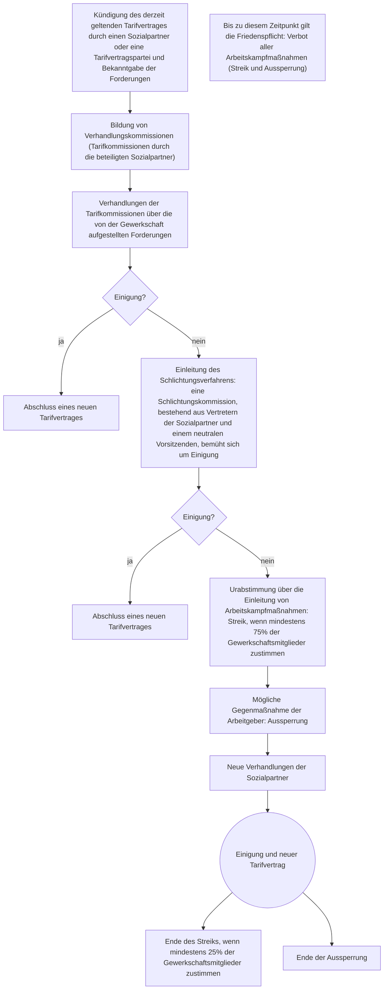

```table-of-contents
```

## Block 1
#### Rechtliche Grundlagen der Berufsausbildung
###### BBiG Berufsbildungsgesetz
- regelt **Rechten** und **Pflichten** für Ausbildende und Auszubildende
- spezielle **Ausbildungsordnung** für jeweilige Ausbildung
- **Achtung: Probezeit: wichtig zu beachten, dass BEIDE Seiten etwas von der Probezeit haben**
![[Pasted image 20250316112230.png]]
#### Jugendarbeitsschutzgesetz
- regelt wie, wann und was Minderjährige bei der Arbeit dürfen
- von 15 - 18
- Stichtag bei Urlaub ist immer der 1.1. eines Jahres
![[Pasted image 20250316112459.png]]

## Block 2
### Sozialversicherungen

## Block 3
### Betriebliche Mitbestimmung
## Block 4
### Tarifrecht
![[Pasted image 20260705144220.png]]
- aus Grundgesetz ergibt sich **Koalitionsfreiheit**, daher Gewerkschaften und Arbeitgeberverbände
- deren Verhandlungen sind durch **Tarifautonomie** geschützt
- beide zusammen = Tarifpartner, Sozialpartner

##### Gewerkschaften
**Aufgaben**
- Führung von Tarifverhandlungen und Abschluss von Tarifverträgen
- Gewährung von Streikgeld, Rechtsberatung und -vertretung, günstigen Versicherungen und anderen Dienstleistungen für ihre Mitglieder
- Kooperation mit Betriebsräten und Interessenvertretung der Mitglieder in Betrieben durch gewerkschaftliche Vertrauensleute
- Einwirkung auf die Gesetzgebung, v. a. in der Sozial-, Wirtschafts- und Bildungspolitik

##### Arbeitgeberverbände
- haben sich als Gegenstück zu Gewerkschaften gebildet

**Aufgaben**
- Aushandlung und Abschluss von Tarifverträgen sowie die Bereitstellung von  
Arbeitskampf-Ausgleichsfonds
- Information der Mitglieder und Förderung des Erfahrungsaustauschs bezüglich  
wirtschaftlicher, rechtlicher und sozialer Entwicklungen
- Vertretung der Mitglieder vor Gerichten und Einigungsstellen, bei der Arbeitsverwaltung und den Sozialversicherungen

#### Ablauf bei Tarifverhandlungen


##### Streik und Aussperrung
- ein Streik **muss** von einer Gewerkschaft getragen werden (sonst "wilder Streik")
- er muss eine **tarifvertragliche Regelung** zum Ziel haben (keine politischen Streiks)
- muss Ultima Ratio sein
- nicht gegen Friedenspflicht verstoßen
- nicht gegen Gesetze verstoßen
- Verhältnismäßig sein
Während eines Streiks **ruht** das Arbeitsverhältnis. Es wird von der Gewerkschaft ein Streikgeld gezahlt.

##### Streikarten
- **Flächen- oder Vollstreik** sein; d.h. alle Arbeitnehmer eines Tarifgebiets legen die Arbeit niede
- **Schwerpunktstreik** sein; d.h. nur in einzelnen Betrieben oder Betriebsteilen wird die Arbeit niedergelegt.
- **Sympathiestreik** **bzw. Solidaritätsstreik** sein; d.h. im Arbeitskampf stehende Arbeitnehmer eines anderen Tarifgebietes oder eines anderen Wirtschaftszweiges sollen unterstützt werden. In der Bundesrepublik sind derartige Streiks rechtlich nicht zulässig. (_Es gibt aber ein Urteil, dass das BAG einen Sympathiestreik als verhältnismäßig anerkannt hat;_ _BAG, Urteil vom 19. Juni 2007 - 1 AZR 396/06 Art. 9 Abs. 3 GG_)
- **Warnstreik** sein; d.h. durch kurzfristige Arbeitsniederlegung wird demonstriert, dass die Arbeitnehmer zum Streik entschlossen sind.

Die **Aussperrung** ist die Antwort der Arbeitgeber auf einen Streik, dabei werden Werke geschlossen.

##### Tarifverträge
- schriftlicher Vertrag zwischen Arbeitgeber/Arbeitgeberverband und Gewerkschaft
- **schuldrechtlicher Teil** z.B. die Friedenspflicht
- **normativer Teil** regelt Inhalt von Arbeitsverhältnissen wie Entgeltgruppen, Urlaub etc.

Tarifverträge gelten **räumlich** für bestimmte Gebiete, **fachlich-betrieblich** für bestimmte Betriebe/Branchen, **persönlich** für bestimmte Beschäftigtengruppen und **zeitlich** für einen festgelegten Zeitraum.

###### Tarifvertragsarten
- **Verbandstarifverträge:** 
	Vertragspartner sind Arbeitgeberverbände einer Branche in einer Region und Gewerkschaften
- **Haus-, Firmen- oder Werktarifverträge:** 
	Vertragspartner sind ein einzelner Arbeitgeber und die für den Betrieb zuständige Gewerkschaft
- **Lohn- und Gehaltstarifverträge (Vergütungstarifverträge):**
	regeln vorwiegend die geldlichen Arbeitsbedingungen (Stundenlöhne, Monatsgehälter, Ausbildungsvergütungen, konkrete Höhe des Ecklohns etc.). Sie haben kurze Laufzeiten (in der Regel ein bis zwei Jahre).
- **Rahmentarifverträge:** 
	definieren Eingruppierungsgrundsätze, die Einteilung von Entgeltgruppen (unter Berücksichtigung von Ausbildung, Alter, Schwierigkeitsgrad der Tätigkeit etc.) und die Entgeltstufen. Sie haben in der Regel eine Laufzeit von mehreren Jahren. %% In manchen Tarifbereichen gibt es keine Rahmentarifverträge und die entsprechenden Regelungen sind Bestandteil des Manteltarifvertrags. %%
- **Manteltarifverträge:**
	regeln allgemeine/ grundsätzliche Arbeitsbedingungen (z.B. wöchentliche Arbeitsstunden, Urlaubstage, Weihnachts- und Urlaubsgeld, Zuschläge für Mehr-, Nacht-, Schicht-, Akkord-, Sonn- und Feiertagsarbeit etc.). Sie haben in der Regel eine Laufzeit von mehreren Jahren.

Die **Allgemeinverbindlicherklärung** eines Tarifvertrags erweitert ihn auf nicht tarifgebundene Arbeitgeber und Arbeitnehmer. Sie wird vom Bundesministerium für Arbeit und Soziales oder von der zuständigen obersten Arbeitsbehörde eines Bundeslandes im Einvernehmen mit dem Tarifausschuss ausgesprochen.