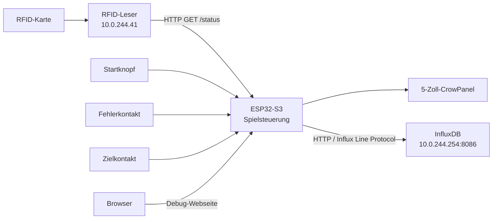
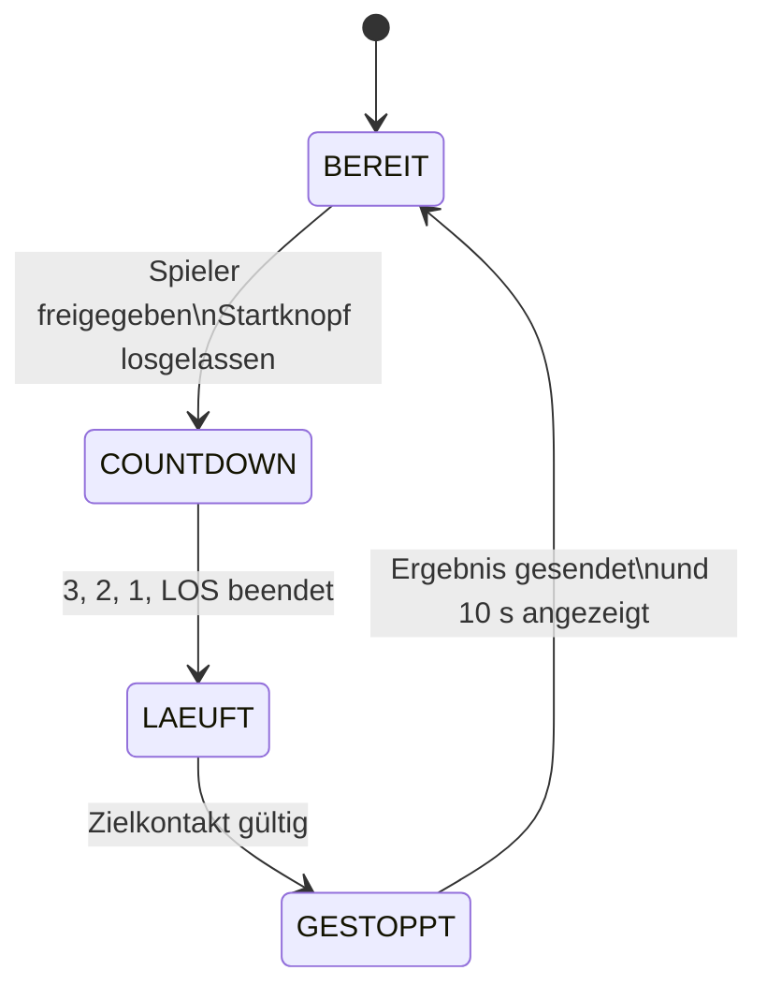

# Heißer Draht – Präsentation und Fachgespräch einfach erklärt

Diese Datei ist ein Lernzettel für die Präsentation und das Fachgespräch. Sie ist bewusst einfacher und ausführlicher geschrieben als eine normale technische Projektdokumentation.

> **Der wichtigste Satz zum Projekt:**  
> Unsere ESP32-Station führt ein Heißer-Draht-Spiel aus, identifiziert den Spieler über einen externen RFID-Leser, zeigt den Spielstand auf einem Display und sendet Live-Daten sowie das Endergebnis per WLAN an InfluxDB.

---

## 1. Was das System macht

Ein Spieler meldet sich mit einer RFID-Karte an. Der RFID-Leser liefert dem Spiel:

- eine Benutzer-ID (`user_id`),
- einen Anzeigenamen (`username`),
- eine Durchlauf-ID (`run_id`) und
- einen Status, zum Beispiel `logged_in` oder `already_played`.

Wenn der Spieler freigegeben ist, leuchtet der Startknopf. Nach dem Drücken läuft ein Countdown. Während des Spiels misst der ESP32 die Zeit, zählt Berührungen des Drahts als Fehler und berechnet laufend die Punkte. Das Erreichen des Zielkontakts beendet das Spiel. Anschließend wird ein fertiger Datensatz an InfluxDB geschickt und die RFID-Sitzung wird beendet.



---

## 2. Vorschlag für eine kurze Präsentation

### Folie 1 – Aufgabe

„Wir haben eine digitale Station für das Geschicklichkeitsspiel Heißer Draht gebaut. Die Station erkennt den Spieler, steuert den Spielablauf, wertet Zeit und Fehler aus und speichert die Ergebnisse zentral.“

### Folie 2 – Hardware

Zeigt den ESP32 mit Display, den beleuchteten Startknopf, den Drahtkontakt und den Zielkontakt. Erklärt dazu: Der ESP32 ist die zentrale Steuerung. Der RFID-Leser und die Datenbank sind eigenständige Geräte im WLAN.

### Folie 3 – Spielablauf

Zeigt die vier Zustände `BEREIT`, `COUNTDOWN`, `LAEUFT` und `GESTOPPT`. Erklärt, dass der Code je nach Zustand nur die jeweils erlaubten Aktionen ausführt. Dadurch kann beispielsweise ein Zielkontakt vor dem Start kein Spiel beenden.

### Folie 4 – Kommunikation

Der ESP32 fragt den RFID-Leser per HTTP ab. Die Antwort ist JSON. Messwerte gehen im InfluxDB Line Protocol an die Datenbank. Eine lokale Debug-Webseite und die serielle Ausgabe helfen bei der Fehlersuche.

### Folie 5 – Ausfallsicherheit

Nennt drei konkrete Beispiele:

1. Der Zielkontakt muss erst offen und danach stabil geschlossen sein.
2. Ein Endergebnis wird vor dem Senden im nichtflüchtigen Speicher vorgemerkt.
3. Nach einem Neustart wird nur die passende gespeicherte RFID-Sitzung abgemeldet.

### Folie 6 – Ergebnis

Führt einen Lauf vor und zeigt anschließend den fertigen Datensatz oder die Debug-Seite. Erwähnt zum Schluss mögliche Weiterentwicklungen, etwa die Stabilisierung der Firmware des RFID-Lesers oder eine zentrale Geräteüberwachung.

---

## 3. Hardware und Anschlüsse

| Bestandteil | Anschluss / Adresse | Aufgabe |
|---|---:|---|
| CrowPanel mit ESP32-S3 | – | führt das Programm aus und zeigt die Oberfläche |
| Display-Hintergrundbeleuchtung | GPIO 2 | schaltet die Displaybeleuchtung ein |
| Startknopf | GPIO 44 | startet ein freigegebenes Spiel |
| Beleuchtung des Startknopfs | GPIO 43 | zeigt an, ob beziehungsweise in welchem Zustand gestartet werden kann |
| Fehlerkontakt am Draht | GPIO 19 | zählt Drahtberührungen |
| Zielkontakt | GPIO 20 | beendet einen gültigen Lauf |
| Spielstation | `10.0.244.40` | feste IP-Adresse des CrowPanels |
| RFID-Leser | `10.0.244.41` | liefert Spieler- und Laufdaten |
| InfluxDB | `10.0.244.254:8086` | speichert Live-Daten und Endergebnisse |

Die drei Taster beziehungsweise Kontakte verwenden `INPUT_PULLUP`. Der ESP32 hält den Eingang intern auf `HIGH`. Beim Schließen wird er mit Masse verbunden und ist `LOW`.

**Merksatz:** Bei `INPUT_PULLUP` bedeutet `HIGH` meist offen und `LOW` meist gedrückt oder geschlossen.

Die LED des Startknopfs ist ebenfalls „active low“: `LOW` schaltet sie ein, `HIGH` schaltet sie aus. Das wirkt zunächst umgekehrt, liegt aber an der elektrischen Verdrahtung.

---

## 4. Aufbau der Software

| Datei | Inhalt |
|---|---|
| `heisser_draht.ino` | zentrale Spiellogik, GPIOs, Zustände, Zeit, Fehler, Punkte und `setup()`/`loop()` |
| `api.cpp` / `api.h` | Kommunikation mit RFID-Leser und InfluxDB, Wiederholungen und nichtflüchtiger Speicher |
| `graphics.cpp` / `graphics.h` | sämtliche Anzeigen und Animationen auf dem Display |
| `debug_web.cpp` / `debug_web.h` | lokale Debug-Webseite, Status-API und Log-Ausgabe |
| `project_config.h` | nicht geheime Einstellungen wie IPs, Intervalle, Zielzeit und Testmodus |
| `secrets.h` | nur geheime Werte: WLAN-Passwort und InfluxDB-Token |
| `tools/influx_ergebnisse.py` | liest abgeschlossene, plausible Ergebnisse aus InfluxDB |
| `tests/run_zielkontakt_tests.py` | prüft wichtige Fälle der Zielkontakterkennung |

Diese Trennung hält die Spiellogik lesbar. Änderungen an der Darstellung gehören zum Beispiel in `graphics.cpp`, während Netzwerkprotokolle in `api.cpp` bleiben.

---

## 5. `setup()` und `loop()`

Arduino-Programme besitzen zwei zentrale Funktionen:

- `setup()` läuft genau einmal nach dem Einschalten oder Neustart.
- `loop()` läuft danach immer wieder von oben nach unten.

In `setup()` werden Speicher, GPIOs, Display, WLAN, Testspieler und Debug-Webserver vorbereitet.

In `loop()` werden fortlaufend:

1. die Eingänge gelesen,
2. der Startknopf verarbeitet,
3. Countdown und Spielkontakte geprüft,
4. Anzeige und Animation aktualisiert,
5. WLAN, RFID, Debug-Webserver und ausstehende Uploads bearbeitet und
6. während eines Spiels regelmäßig Live-Daten versendet.

Der Code verwendet für zeitliche Abläufe überwiegend `millis()` statt langer `delay()`-Aufrufe. Dadurch kann der ESP32 während eines Countdowns oder einer Wartezeit weiterhin Kontakte und Netzwerkaufgaben bearbeiten.

---

## 6. Zustandsautomat des Spiels



### `BEREIT`

Der ESP32 wartet auf einen gültigen Spieler. Der Start ist nur freigegeben, wenn ein RFID-Spieler angemeldet beziehungsweise der Testspieler aktiv ist und kein Endergebnis mehr auf den Upload wartet.

### `COUNTDOWN`

Das Display zeigt 3, 2, 1 und LOS. In dieser Phase wird kein RFID-Logout ausgeführt. Nach dem Countdown werden Zeit und Fehler zurückgesetzt.

### `LAEUFT`

Der ESP32 zählt Fehler, aktualisiert Zeit und Punkte und schickt etwa jede Sekunde Live-Daten. RFID-Polling findet während des Laufs nicht statt, damit die Spielsteuerung ruhig und vorhersehbar bleibt.

### `GESTOPPT`

Das Ergebnis wird angezeigt und an InfluxDB geschickt. Nach erfolgreichem Upload bleibt der Endbildschirm höchstens zehn Sekunden sichtbar. Solange ein Endergebnis nicht sicher übertragen wurde, wird kein neues Spiel freigegeben.

---

## 7. Startknopf und seine Beleuchtung

Ein kurzer Tastendruck startet das Spiel erst beim Loslassen. Vorher wird noch geprüft, ob der Spieler freigegeben ist und die aktive Sitzung dauerhaft gespeichert werden konnte.

Wird der Taster im Bereitschaftszustand fünf Sekunden gehalten, wechselt die Station zwischen Test- und Livebetrieb. Der gewählte Modus wird im NVS gespeichert und bleibt daher nach einem Neustart erhalten.

| LED-Verhalten | Bedeutung |
|---|---|
| aus | Start ist nicht erlaubt oder das Spiel läuft |
| dauerhaft an | ein Spieler ist freigegeben und die Station ist startbereit |
| langsam blinkend, 500 ms | RFID-Leser wurde nach mehreren Fehlern als offline erkannt |
| schnell blinkend, 100 ms | dieselbe Karte liegt nach mehreren Anwesenheitsprüfungen immer noch auf |

---

## 8. Fehlerkontakt: Warum eine Flanke gezählt wird

Der Fehlerkontakt zählt nur den Wechsel von `HIGH` nach `LOW`. Dieser Wechsel heißt fallende Flanke.

```text
offen       HIGH
Berührung   LOW   -> genau hier +1 Fehler
bleibt dran LOW   -> kein weiterer Fehler
losgelassen HIGH  -> noch kein Fehler
erneut dran LOW   -> wieder +1 Fehler
```

Nach einem erkannten Fehler gilt zusätzlich eine Sperrzeit von 250 ms. Sie verhindert, dass mechanisches Prellen oder sehr schnelles elektrisches Schwanken mehrere Fehler aus einer einzigen Berührung erzeugt.

Am Ende jedes `loop()`-Durchlaufs wird der aktuelle Eingang in `errorAlt` gespeichert. Beim nächsten Durchlauf ist er der alte Vergleichswert. Deshalb muss diese Zuweisung **nach** der Erkennung stehen: Würden alter und neuer Wert vorher gleichgesetzt, könnte der Code keine Flanke mehr erkennen.

---

## 9. Zielkontakt: Schutz gegen ein falsches Spielende

Ein einfacher Test auf `LOW` wäre gefährlich. Wenn der Zielkontakt beim Spielstart bereits geschlossen ist oder kurz Störungen auftreten, könnte der Lauf sofort als beendet gelten.

Die Klasse `Zielkontakt` verlangt deshalb:

1. Der Kontakt muss zuerst mindestens 100 ms stabil offen sein. Damit wird er „freigegeben“.
2. Danach muss er mindestens 100 ms stabil geschlossen sein.
3. Erst dann wird das Spiel beendet.

Ändert sich der Pegel oder liegt zwischen zwei Prüfungen eine Lücke von mehr als 50 ms, beginnt die Stabilitätszeit erneut. Diese Logik schützt gegen Prellen, kurze Störungen und einen schon beim Start geschlossenen Kontakt.

---

## 10. Punkteberechnung

Die Formel lautet:

```text
Punkte = 100 + Zielzeit - (Spielzeit in Sekunden + Fehler × 2,5)
```

Danach wird auf eine ganze Zahl gerundet und auf den Bereich 0 bis 100 begrenzt. Die aktuelle Zielzeit beträgt 25 Sekunden.

Beispiel: Ein Spieler braucht 30 Sekunden und hat zwei Fehler.

```text
100 + 25 - (30 + 2 × 2,5)
= 125 - 35
= 90 Punkte
```

Ein Ergebnis kann nie größer als 100 und nie kleiner als 0 werden.

### Erkennung eines Dauerkontakts

Die normale Fehlerzählung reagiert nur auf eine neue Berührung. Zusätzlich misst
die Station deshalb die gesamte Zeit, in der der Fehlerkontakt geschlossen ist.
Ein Lauf wird ungültig, wenn der Kontakt mindestens 3 Sekunden und zugleich
mindestens 30 Prozent der gesamten Laufzeit geschlossen war. Beide Grenzwerte
stehen in `project_config.h`.

Bei einem ungültigen Lauf zeigt der Endbildschirm den Kontaktanteil. InfluxDB
erhält `valid=false` und `Endscore=0`; der normale Rechenwert bleibt als
`berechneterScore` für die Diagnose erhalten.

Sobald beide Grenzwerte während eines Laufs erreicht sind, warnt die Anzeige
rot vor dem Dauerkontakt. Die endgültige Entscheidung fällt trotzdem erst am
Ziel, weil der prozentuale Anteil bei normalem Weiterspielen wieder sinken kann.

---

## 11. Kommunikation mit dem RFID-Leser

Im Livebetrieb ruft der ESP32 regelmäßig folgende Adresse ab:

```text
GET http://10.0.244.41/status
```

Die Antwort wird als JSON gelesen. Unterstützte Zustände sind:

| Status | Bedeutung und Reaktion |
|---|---|
| `logged_in` | Benutzer-ID, Benutzername und Run-ID werden übernommen; Start wird freigegeben |
| `not_found` | Karte beziehungsweise Benutzer wurde nicht gefunden; Fehlermeldung wird angezeigt |
| `already_played` | Spieler hat diese Station im Durchlauf bereits gespielt; Meldung und 5-s-Countdown, danach Logout |
| `idle` | keine Karte aktiv; vorhandene lokale Freigabe wird bei einer Anwesenheitsprüfung entfernt |

Der normale Poll-Abstand beträgt drei Sekunden. Erst nach drei aufeinanderfolgenden Fehlern gilt der Leser als offline. HTTP-Verbindungen werden bewusst geschlossen, damit auf dem kleinen Webserver des RFID-ESP keine alten Verbindungen liegen bleiben.

### Anwesenheitsprüfung

Wenn ein Spieler freigegeben ist, aber nicht startet, wird nach jeweils 15 Sekunden geprüft, ob seine Karte noch da ist. Bleibt dieselbe Karte liegen, ändert sich der Text schrittweise:

1. zunächst: `Bereit zum Start, <Name>?`
2. nach der zweiten Bestätigung: `Noch da, <Name>?`
3. nach der dritten: `Hallo? <Name>??`
4. nach der vierten: `Jetzt fang endlich an, <Name>`
5. ab der fünften: `Karte entfernen bitte, es reicht`

Bei `idle` geht die Station zurück zum normalen Login-Bildschirm. Wird eine andere gültige Karte erkannt, übernimmt sie den neuen Spieler.

### Sonderfall Testkarte

Die konfigurierte physische Testkarte darf auch mit derselben Run-ID wiederholt spielen. Für normale Benutzer verhindert die Kombination aus Benutzer-ID und Run-ID einen zweiten Lauf an derselben Station.

### Sicheres Logout nach einem Neustart

Vor dem Countdown speichert der ESP32 Benutzer-ID, Run-ID und Leseradresse im nichtflüchtigen Speicher. Nach einem Absturz oder Neustart fragt er `/status` ab. Ein Logout wird nur ausgelöst, wenn aktuell genau derselbe Benutzer mit derselben Run-ID angemeldet ist. So wird nicht versehentlich ein neuer Spieler abgemeldet.

Nach einem regulär beendeten Spiel wird ebenfalls ein Logout angefordert. Der Endpunkt lautet:

```text
GET http://10.0.244.41/logout?user_id=<User-ID>&run_id=<Run-ID>
```

Der RFID-Leser muss beide Werte selbst mit seiner aktiven Sitzung vergleichen.
Nur dann sind Vergleich und Logout eine atomare Operation.

---

## 12. Testmodus

Der Testmodus erlaubt Tests ohne RFID-Leser. Er verwendet feste Daten:

```text
userID  = 6767
run_id  = 999
username = Testspieler
```

InfluxDB bleibt im Testmodus aktiv. Testläufe lassen sich daher später über `run_id=999` erkennen und aus einer Ergebnisliste herausfiltern.

`HEISSER_DRAHT_TEST_MODE` in `project_config.h` bestimmt nur den Standard beim allerersten Start. Danach hat der im NVS gespeicherte Modus Vorrang. Der Wechsel erfolgt im Bereitschaftsbildschirm durch fünf Sekunden langes Halten des Startknopfs.

---

## 13. Daten in InfluxDB

Die Station schreibt in:

```text
Organisation: FIT244
Bucket:       HeisserDraht
Measurement:  heisser_draht
Zeitpräzision: Millisekunden
```

### Live-Datensatz

Etwa einmal pro Sekunde wird während des Spiels beispielsweise gesendet:

```text
heisser_draht,userID=6767,run_id=999 zeitMs=1200i,fehler=1i,kontaktMs=300i,kontaktAnteil=0.25
```

Enthalten sind Benutzer-ID, Run-ID, vergangene Zeit, Fehlerzahl, gesamte
Kontaktzeit und deren Anteil an der bisherigen Laufzeit.

### Fertiger Datensatz

Am Ziel kommt ein eigener Abschlusspunkt hinzu:

```text
heisser_draht,userID=6767,run_id=999,result_id=abc-123 zeitMs=30120i,fehler=2i,kontaktMs=1200i,kontaktAnteil=0.0398,Endscore=90i,berechneterScore=90i,finished=true,valid=true
```

`finished=true` macht das echte Endergebnis eindeutig filterbar. `valid` sagt,
ob der Lauf gewertet werden darf. `Endscore` enthält die endgültigen Punkte.
Ungültige Läufe erhalten den Endscore 0. Die `result_id` bleibt bei
Wiederholungsversuchen gleich und ermöglicht es, doppelt übertragene Ergebnisse
beim Auswerten zu erkennen.

Benutzer-ID, Run-ID und Result-ID sind Tags, weil häufig danach gefiltert beziehungsweise gruppiert wird. Zeit, Fehler, Endscore und Finished sind Messfelder.

### Schutz bei Upload-Fehlern

Vor dem ersten Sendeversuch wird das Endergebnis im NVS vorgemerkt. Schlägt die Übertragung fehl, folgen höchstens vier weitere Versuche im Abstand von fünf Sekunden. Auch fehlendes WLAN zählt als Versuch. Während ein Endergebnis aussteht, ist der nächste Start gesperrt.

Sind alle Versuche verbraucht, bleibt eine sichtbare Fehlermeldung bestehen. Dadurch geht ein Fehler nicht unbemerkt unter und ein neues Spiel überschreibt nicht einfach den problematischen Zustand.

Die Live-Werte laufen in einer eigenen FreeRTOS-Aufgabe. Eine Queue der Länge eins enthält immer nur den neuesten noch nicht bearbeiteten Wert. So blockiert eine langsame Netzwerkanfrage die zeitkritische Kontakterkennung möglichst wenig und es entsteht kein wachsender Rückstau alter Live-Werte.

---

## 14. Anzeige und Debugging

Der Startbildschirm zeigt den RFID- und Netzwerkzustand, den Spieler und eine kleine Funkenanimation. Während des Spiels werden Name, Zeit, Fehler und Punkte angezeigt. Textbereiche werden vor dem Neuzeichnen vollständig gelöscht, damit keine alten Buchstaben oder einzelnen Pixel stehen bleiben.

Zur Diagnose gibt es zwei Wege:

- serielle Ausgabe mit 115200 Baud,
- Debug-Webseite unter `http://10.0.244.40/`.

Die Webseite besitzt außerdem die Endpunkte `/api/status` und `/api/log`. Dort sieht man unter anderem Spielzustand, Modus, Spieler, letzte Netzwerkereignisse, Uploadversuche und Firmware-Build.

---

## 15. Was passiert bei Fehlern?

| Problem | Reaktion des Systems |
|---|---|
| RFID-Leser antwortet einmal nicht | noch keine Offline-Meldung; Fehlerzähler steigt |
| RFID-Leser antwortet dreimal nacheinander nicht | Offline-Anzeige und langsam blinkender Startknopf |
| WLAN fehlt beim Ergebnis-Upload | zählt als Uploadversuch; neuer Start bleibt gesperrt |
| InfluxDB lehnt Ergebnis ab | bis zu vier Wiederholungen, dann dauerhafte Fehlermeldung |
| ESP32 startet mitten in einer RFID-Sitzung neu | gespeicherte Sitzung wird mit `/status` verglichen und nur bei exakter Übereinstimmung ausgeloggt |
| Zielkontakt ist beim Start geschlossen | kein Spielende; er muss erst stabil offen und danach stabil geschlossen werden |
| Fehlerkontakt prellt | Flankenerkennung und 250-ms-Sperre verhindern Mehrfachzählungen |
| Spieler lässt Karte liegen | regelmäßige Anwesenheitsprüfung und zunehmend deutliche Hinweise |

Eine bekannte praktische Grenze ist der RFID-Leser selbst: Er war nach längerer Laufzeit teilweise noch im Browser langsam erreichbar, während kurze Anfragen der Station bereits in ein Timeout liefen. Die Spielstation reduziert das durch längere Poll-Abstände, mehrere Fehlversuche und geschlossene HTTP-Verbindungen. Eine vollständige Lösung muss gegebenenfalls auch in der Serverlogik des RFID-Lesers erfolgen.

---

## 16. Typische Fragen im Fachgespräch

### Warum braucht ihr einen Zustandsautomaten?

Damit nur passende Aktionen erlaubt sind. Ein Start ist nur in `BEREIT` möglich, Kontakte zählen nur in `LAEUFT`, und ein Ergebnis wird in `GESTOPPT` verarbeitet. Das verhindert viele ungewollte Zustandskombinationen.

### Warum verwendet ihr `millis()` statt überall `delay()`?

`delay()` hält den aktuellen Ablauf an. Mit Zeitvergleichen über `millis()` können Display, Kontakte, Webserver und Netzwerk scheinbar gleichzeitig weiterarbeiten.

### Was ist eine Flanke?

Eine Flanke ist der Wechsel eines digitalen Signals. Für einen Fehler zählt nur `HIGH` nach `LOW`. Ein dauerhaft geschlossener Kontakt erzeugt deshalb nur einen Fehler.

### Was bedeutet Entprellen?

Mechanische Kontakte wechseln beim Drücken kurz mehrfach zwischen offen und geschlossen. Entprellen filtert diese schnellen Wechsel, damit eine Betätigung nur einmal zählt.

### Warum ist `LOW` bei euch „gedrückt“?

Die Eingänge verwenden interne Pull-up-Widerstände. Offen liegen sie auf `HIGH`; der geschlossene Kontakt verbindet sie mit Masse und erzeugt `LOW`.

### Warum sendet ihr Live-Daten und ein Endergebnis?

Live-Daten ermöglichen eine laufende Anzeige oder Analyse. Das Endergebnis besitzt zusätzlich `finished=true` und `Endscore` und kennzeichnet eindeutig einen sauber abgeschlossenen Lauf.

### Warum ist das Measurement nötig, wenn der Bucket schon HeisserDraht heißt?

Der Bucket ist der größere Speicherbereich. Das Measurement beschreibt die Art der Messreihe innerhalb des Buckets. Es gehört außerdem zwingend zum Influx Line Protocol. Auch bei nur einer Messreihe braucht jeder Datenpunkt einen Measurement-Namen.

### Warum sind Benutzer-ID und Run-ID Tags?

Tags sind für häufiges Filtern und Gruppieren gedacht. Messwerte wie Zeit oder Fehler verändern sich ständig und gehören deshalb in Fields.

### Warum speichert ihr das Endergebnis im NVS?

NVS ist nichtflüchtig. Bei einem Neustart bleibt ein vorgemerkter Datensatz erhalten und kann später erneut gesendet werden. Eine normale RAM-Variable wäre nach dem Neustart verloren.

### Was ist der Unterschied zwischen HTTP und JSON?

HTTP ist das Übertragungsprotokoll für Anfrage und Antwort. JSON ist das Datenformat im Inhalt der RFID-Antwort. Beim Schreiben in InfluxDB wird statt JSON das Influx Line Protocol verwendet.

### Warum startet das Spiel nicht, wenn ein Ergebnis noch aussteht?

Ein weiterer Lauf würde neue Zustände erzeugen, obwohl das vorherige Ergebnis noch nicht sicher gespeichert ist. Die Sperre bewahrt die Reihenfolge und macht den Fehler sichtbar.

### Warum wird beim Neustart nicht immer `/logout` aufgerufen?

Inzwischen könnte sich ein anderer Spieler angemeldet haben. Deshalb vergleicht die Station den aktuell gemeldeten Benutzer und die Run-ID mit der zuvor gespeicherten Sitzung.

### Ist das Logout vollständig atomar?

Nein. Statusprüfung und Logout sind zwei einzelne HTTP-Anfragen. Zwischen beiden könnte sich der Zustand ändern. Absolute Sicherheit wäre nur möglich, wenn der RFID-Leser beim Logout Benutzer- und Run-ID entgegennimmt und selbst atomar vergleicht.

### Was ist FreeRTOS in diesem Projekt?

FreeRTOS ist das Echtzeitbetriebssystem, das auf dem ESP32 läuft. Wir verwenden eine eigene Task und eine Queue für Live-Uploads, damit langsame HTTP-Anfragen die Spiellogik weniger beeinflussen.

### Was würdet ihr als Nächstes verbessern?

Sinnvolle nächste Schritte wären ein bedingtes Logout direkt auf dem RFID-Leser, ein kontrollierter Wiederanlauf nach endgültigem Influx-Fehler, Langzeittests mit Netzwerkausfällen und eine gemeinsame Überwachung aller Stationen.

---

## 17. Demo-Checkliste

Vor der Präsentation:

- CrowPanel, RFID-Leser und InfluxDB befinden sich im selben Netzwerk.
- Die Station hat `10.0.244.40`, der RFID-Leser `10.0.244.41`.
- Der Livebetrieb ist aktiv; alternativ ist der Testmodus bewusst gewählt.
- Start-, Fehler- und Zielkontakt funktionieren elektrisch.
- Die Debug-Seite unter `http://10.0.244.40/` ist erreichbar.
- Eine Karte liefert unter `http://10.0.244.41/status` gültige Daten.
- InfluxDB nimmt einen Testdatensatz an.
- Eine Person weiß, wie der 5-Sekunden-Moduswechsel funktioniert.

Empfohlener Demoablauf:

1. Karte auflegen und Namen auf dem Startbildschirm zeigen.
2. Leuchtenden Startknopf erklären und drücken.
3. Countdown zeigen.
4. Beim Spielen absichtlich einen Fehler erzeugen.
5. Zielkontakt erreichen.
6. Endscore und erfolgreichen Upload zeigen.
7. Fertigen Datensatz oder Debug-Log öffnen.

Falls der RFID-Leser ausfällt, kann der Testmodus durch fünf Sekunden langes Halten des Startknopfs aktiviert werden. Falls InfluxDB ausfällt, kann gerade dieser Fehlerfall gezeigt werden: Das Ergebnis bleibt vorgemerkt, die Station versucht die Übertragung begrenzt erneut und sperrt einen unkontrollierten Folgestart.

---

## 18. Spickzettel mit den wichtigsten Zahlen

| Wert | Einstellung |
|---|---:|
| maximale Punktzahl | 100 |
| Zielzeit | 25 s |
| Abzug pro Fehler | 2,5 Punkte |
| Anzeigeaktualisierung im Spiel | 100 ms |
| Live-Upload | 1 s |
| Endbildschirm nach erfolgreichem Upload | max. 10 s |
| Fehler-Sperrzeit | 250 ms |
| Ziel muss stabil sein | 100 ms offen, danach 100 ms geschlossen |
| RFID-Polling | 3 s |
| RFID gilt als offline | nach 3 aufeinanderfolgenden Fehlern |
| Karten-Anwesenheitsprüfung | 15 s |
| `already_played`-Hinweis | 5 s |
| Influx-Wiederholung | alle 5 s, maximal 4 Retries |
| Moduswechsel | Startknopf 5 s halten |
| serielle Geschwindigkeit | 115200 Baud |

---

## 19. Begriffe in einem Satz

- **ESP32-S3:** Mikrocontroller mit WLAN, der die Station steuert.
- **GPIO:** frei nutzbarer elektrischer Ein- oder Ausgang des Mikrocontrollers.
- **Pull-up:** Widerstand, der einen offenen Eingang zuverlässig auf `HIGH` hält.
- **Flanke:** Wechsel eines digitalen Signals von einem Pegel zum anderen.
- **Entprellen:** Herausfiltern schneller unerwünschter Kontaktwechsel.
- **HTTP:** Protokoll für Anfragen und Antworten zwischen Netzwerkgeräten.
- **JSON:** gut lesbares Datenformat der RFID-Antwort.
- **InfluxDB:** Zeitreihendatenbank für Messwerte mit Zeitstempel.
- **Line Protocol:** Textformat, in dem Daten an InfluxDB geschrieben werden.
- **NVS:** nichtflüchtiger Speicher im ESP32 für kleine, wichtige Zustände.
- **FreeRTOS-Task:** separat eingeplanter Programmablauf auf dem ESP32.
- **Queue:** sichere Übergabestelle für Daten zwischen Programmteilen beziehungsweise Tasks.
- **Timeout:** maximale Wartezeit auf eine Netzwerkantwort.
- **Retry:** erneuter Versuch nach einem Fehler.
- **State Machine:** Modell, bei dem sich das Programm immer in einem klar definierten Zustand befindet.

---

## 20. Die drei wichtigsten Aussagen zum Merken

1. **Die Zustandsmaschine hält den Spielablauf eindeutig:** bereit, Countdown, laufend, gestoppt.
2. **Kontakte und Netzwerkfehler werden bewusst gefiltert:** Flanken, Stabilitätszeiten, Timeouts und begrenzte Wiederholungen vermeiden falsche Ergebnisse.
3. **Ein fertiger Lauf soll nicht verloren gehen:** Das Endergebnis wird lokal vorgemerkt, eindeutig markiert und erst nach erfolgreicher Übertragung aus dem Speicher entfernt.
