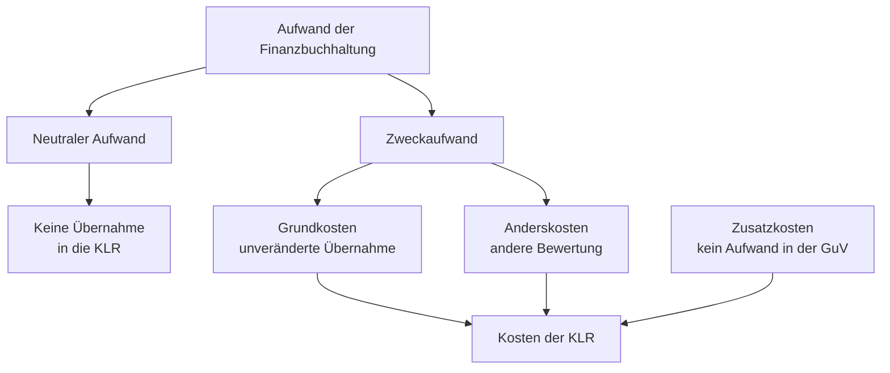
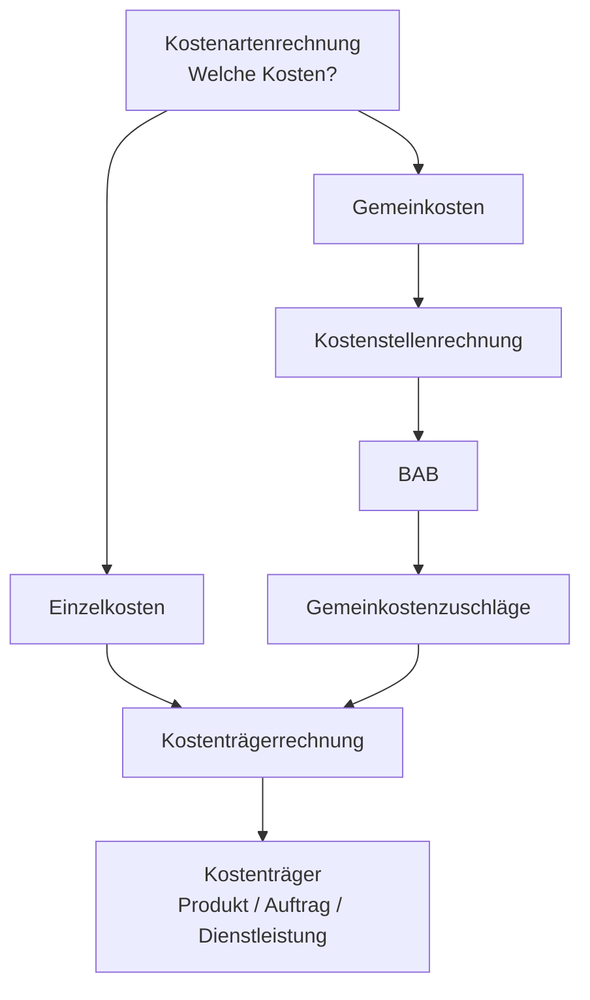
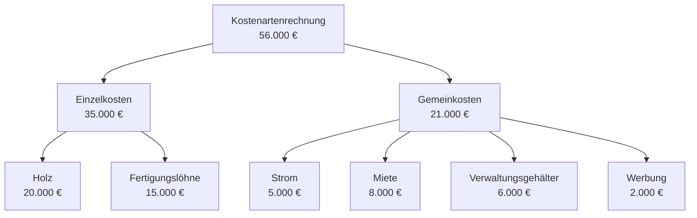
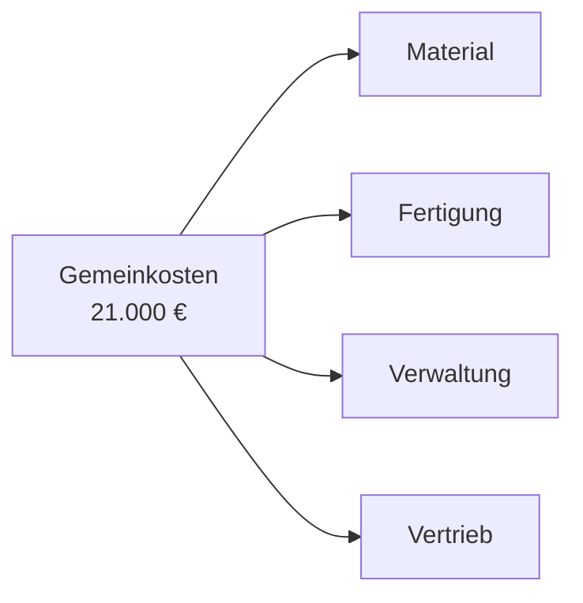
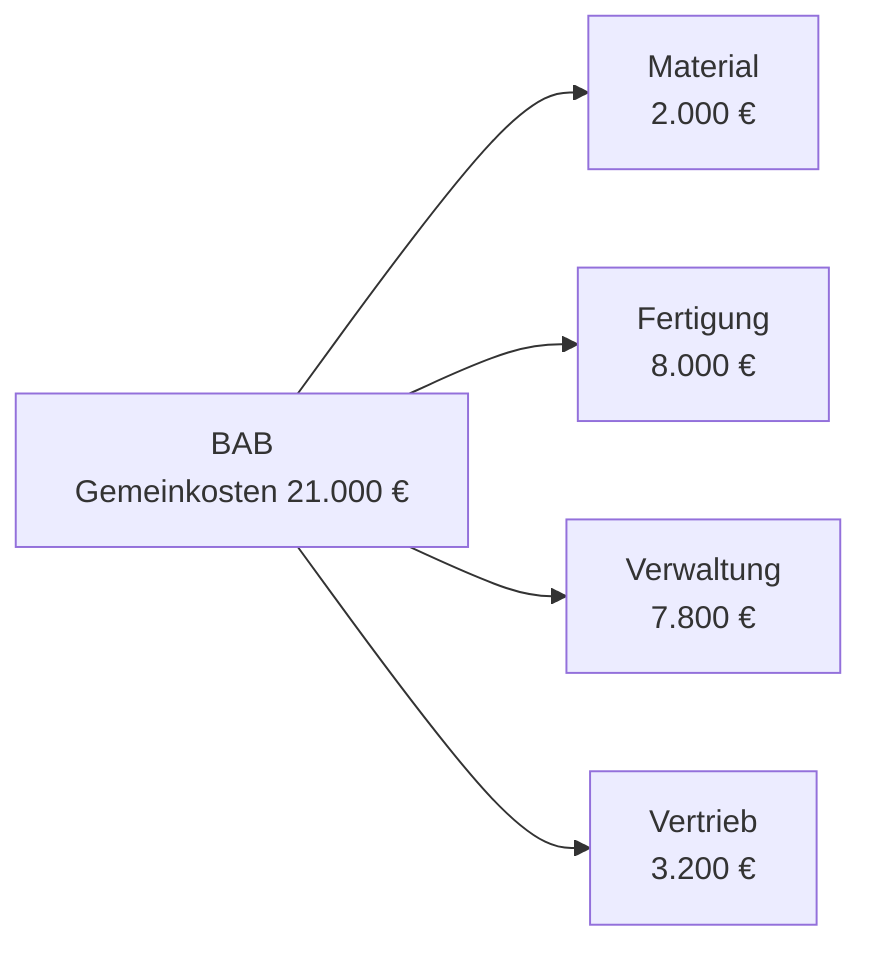
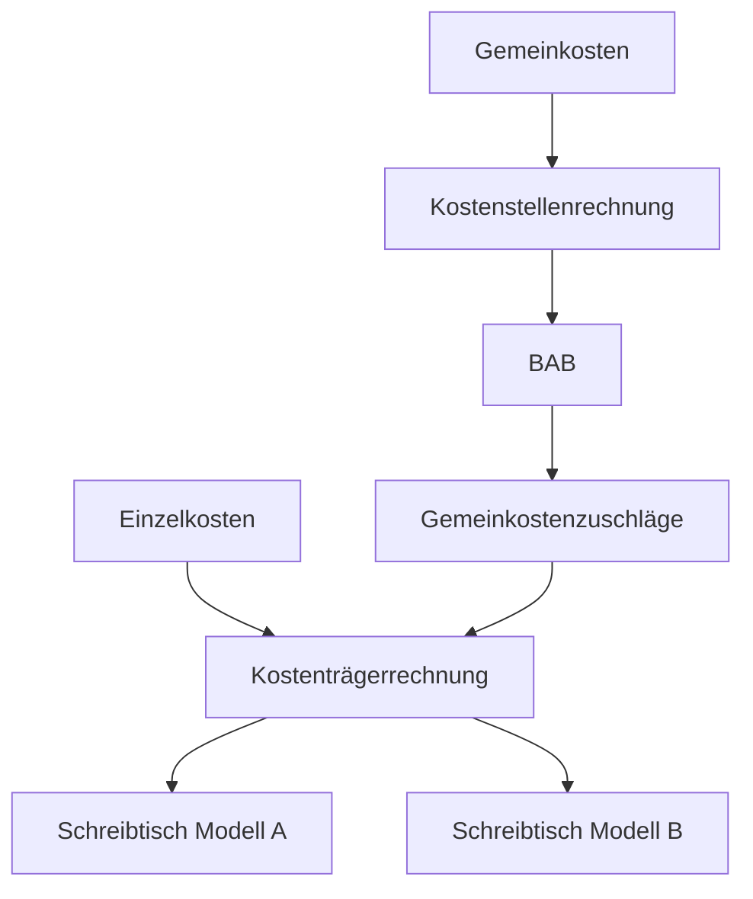
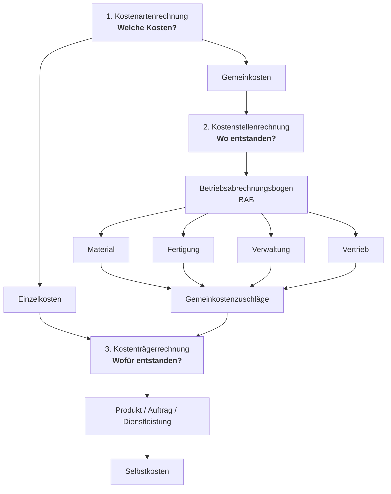
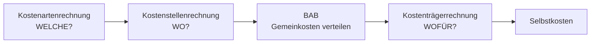

**Inhalt**
```table-of-contents
```

## Block 1
#### Rechts- und Geschäftsfähigkeit
#### Businesspläne

#### Stellung des Betriebs

#### Unternehmenskennzahlen

#### Kaufmannseigenschaften

## Block 2

#### Rechtsformen

#### Beschaffung 
##### Grundbegriffe Bedarfsermittlung

**Primärbedarf**

**Sekundärbedarf**

**Tertiärbedarf**


![[Pasted image 20250701080241.png]]
##### Operative und strategische Beschaffungsaufgaben
##### Beschaffungsstrategien
| **Kriterium**              | **Strategie**                                               | **Beschreibung**                                                                                  |
| -------------------------- | ----------------------------------------------------------- | ------------------------------------------------------------------------------------------------- |
| **Anzahl der Lieferanten** | **Single Sourcing **(Einquellenbeschaffung)                 | Ein Lieferant. Ziel: enge Kooperation, z. B. gemeinsame F&E, Kosten-/Qualitätsvorteile.           |
|                            | **Dual Sourcing **(Zweiquellenbeschaffung)                  | Zwei Lieferanten. Zusätzliches Ziel: Absicherung gegen Lieferausfälle.                            |
|                            | **Multiple Sourcing **(Mehrquellenbeschaffung)              | Mehrere Lieferanten. Ziel: Wettbewerbsdruck, Risikostreuung.                                      |
| **Beschaffungsobjekt**     | **Unit Sourcing **(Einzelteilbeschaffung)                   | Rohmaterialien/Einzelteile werden beschafft und intern weiterverarbeitet.                         |
|                            | **Modular** Sourcing (Modulbeschaffung)                     | Fertige Module (Baugruppen/Systeme) werden beschafft; geringe Fertigungstiefe im eigenen Betrieb. |
| **Beschaffungsareal**      | **Local** Sourcing (regionale Beschaffung)                  | Material aus der Region.                                                                          |
|                            | **Domestic** Sourcing (nationale Beschaffung)               | Material aus dem Inland.                                                                          |
|                            | **Global** Sourcing (weltweite Beschaffung)                 | Material aus dem weltweiten Markt.                                                                |
| **Art der Bereitstellung** | **Stock** Sourcing (Vorratsbeschaffung)                     | Lagerhaltung im Betrieb. Üblich in der Industrie.                                                 |
|                            | **Just-in-time** Sourcing (fertigungssynchrone Beschaffung) | Lieferung genau dann, wenn benötigt. Minimale oder keine Lagerhaltung („Lager auf Rädern“).       |
| **Beschaffungssubjekt**    | **Individual** Sourcing (individuelle Beschaffung)          | Unternehmen beschafft allein.                                                                     |
|                            | **Collective** Sourcing (kollektive Beschaffung)            | Einkaufskooperation mehrerer Unternehmen zur Stärkung der Verhandlungsposition.                   |
##### Make or Buy

###### Kosten als Entscheidungskriterium

Ein Industriebetrieb muss grundsätzlich entscheiden, welche Produkte selbst gefertigt und welche eingekauft werden sollen („Make-or-buy-Entscheidung“). Dabei kann es sich um kurzfristige oder auch um langfristige Entscheidungen handeln. Viele Betriebe gehen dazu über, den Anteil der Eigenfertigung zugunsten des Fremdbezugs zu senken. In deutschen Industriebetrieben liegt die durchschnittliche Fertigungstiefe (Eigenanteil an der Wertschöpfung) heute bei nur noch rund 30 %. Neben anderen Kriterien sind die Kosten ein wichtiges Entscheidungskriterium für eine Make-or-buy-Entscheidung. Diese können vielfach durch Fremdbezug („Outsourcing“) gesenkt werden. Dabei sind zwei Arten von Kosten zu unterscheiden:

- **Fixkosten** (feste Kosten) sind Kosten, die unabhängig von der Produktionsmenge anfallen. Typische Fixkosten sind Gehälter, Heizkosten, Miete und Zinsen.
- **Variable Kosten** (veränderliche Kosten) sind Kosten, die abhängig von der Produktionsmenge anfallen. Typische variable Kosten sind Kosten für Werkstoffe, Zulieferteile und Löhne.

---

###### Kurzfristige Make-or-buy-Entscheidungen

Für eine kurzfristige Make-or-buy-Entscheidung werden nur die variablen Stückkosten (`k_v`) der Eigenfertigung dem Bezugspreis gegenübergestellt. Fixe Kosten bleiben hier unberücksichtigt, da sie kurzfristig ohnehin anfallen und damit von der Entscheidung unabhängig sind. Voraussetzung ist, dass das Unternehmen über freie Produktionskapazitäten verfügt. Es gilt:

$$
k_v < Bezugspreis  ⇒  Eigenfertigung 

k_v > Bezugspreis  ⇒  Fremdbezug
$$

---

###### Langfristige Make-or-buy-Entscheidungen

Bei langfristigen Make-or-buy-Entscheidungen müssen die Fixkosten (z. B. Bau einer Produktionshalle) mit einbezogen werden, da sie im Fall des Fremdbezugs vollständig entfallen. Deshalb werden hier die gesamten Stückkosten (fixe und variable Stückkosten) der Eigenfertigung dem Bezugspreis gegenübergestellt:

$$
\begin{aligned}
k_f + k_v &< \text{Bezugspreis} \quad \Rightarrow \quad \text{Eigenfertigung} \\
k_f + k_v &> \text{Bezugspreis} \quad \Rightarrow \quad \text{Fremdbezug}
\end{aligned}
$$


Wegen der Fixkosten übersteigen die Kosten der Eigenfertigung bei geringen Mengen die Kosten des Fremdbezugs. Unter der Bedingung, dass die variablen Stückkosten der Eigenfertigung geringer sind als der Bezugspreis, lohnt sich die Eigenfertigung erst ab einer bestimmten Menge. Die Menge, bei der die Gesamtkosten der Eigenfertigung und des Fremdbezugs gleich hoch sind, wird als **„kritische Menge“** bezeichnet. Sie kann mathematisch und grafisch ermittelt werden:
###### Formel zur Berechnung der kritischen Menge

$$
K_f + k_v * x = P_FB * x
⇒ x = K_f / (P_FB - k_v)
$$

**Legende:**
- $K_f$ = fixe Gesamtkosten  
- $k_v$ = variable Stückkosten  
- $P_FB$ = Einstandspreis bei Fremdbezug

---
#### Optimale Bestellmenge

###### Beispiel (Ausgangsdaten)
Ein Automobilzulieferer hat einen Jahresbedarf an gehärteten Stahlfedern von **3.000 Stück**.  
- **Einstandspreis pro Stück**: 25,00 €  
- **Bestellkosten je Bestellung**: 140,00 €  
- **Lagerhaltungskostensatz**: 24 %

###### Mathematisches Verfahren (Andler-Formel)

Die optimale Bestellmenge lässt sich mit folgender Formel berechnen:

$$
\text{Optimale Bestellmenge} = \sqrt{ \frac{200 \cdot \text{Jahresbedarf} \cdot \text{Bestellkosten je Bestellung}}{\text{Einstandspreis je Stück} \cdot \text{Lagerhaltungskostensatz}} }
$$

###### Beispielrechnung:

$$
\text{Optimale Bestellmenge} = \sqrt{ \frac{200 \cdot 3000 \cdot 140}{25 \cdot 24} } = \sqrt{140000} \approx 374{,}17\ \text{Stück}
$$

Das Ergebnis ist meist ein **gebrochener Wert** und stellt das **theoretische Optimum** dar.

##### Tabellarisches Verfahren

###### Vorteile:
- Es werden **ganzzahlige Bestellmengen** berechnet.
- **Verpackungseinheiten** (z. B. 100er-Packs) können berücksichtigt werden.
- Für jede Bestellmenge sind **Kosten direkt ablesbar**.

###### Formeln:

**Ø Lagerbestand in Stück:**
$$
\text{Ø Lagerbestand} = \frac{\text{Bestellmenge}}{2}
$$

**Lagerhaltungskosten pro Jahr:**
$$
\text{Lagerhaltungskosten} = \text{Ø Lagerbestand in €} \cdot \text{Lagerhaltungskostensatz}
$$

---
##### Lieferanten- und Angebotsvergleich

| **Lieferanten-EK-Preis/Stk. netto** | in €       |
| ----------------------------------- | ---------- |
| **minus Lieferantenrabatt**         | in % und € |
| **=Zieleinkaufspreis**              | €          |
| **minus Lieferantenskonto**         | € und %    |
| **=Bareinkaufspreis**               | €          |
| **Bezugskosten**                    | €          |
| **=Bezugspreis / Einstandspreis**   | €          |

$$
\begin{aligned}
\text{Einkaufspreis (netto)} &- \text{Lieferantenrabatt} = \text{Zieleinkaufspreis} \\
\text{Zieleinkaufspreis} &- \text{Skonto} = \text{Bareinkaufspreis} \\
\text{Bareinkaufspreis} &+ \text{Bezugskosten} = \text{Bezugspreis (Einstandspreis)}
\end{aligned}
$$

--- 


## Block 3

#### Kaufvertragsrecht

##### Kaufvertragsstörungen
**Überblick**![[01_02_Fallstudie 2 Kaufvertragsstörungen.png]]**1. Nicht-rechtzeitige Lieferung**
Voraussetzungen:
- Fälligkeit - der Zeitpunkt ab dem der Käufer die Übergabe vom Verkäufer verlangen kann. Wenn nicht vereinbart, dann kann der Käufer sofortige Rausgabe verlangen.
- Mahnung - es sei denn es gibt einen kalendermäßig bestimmten Zeitpunkt ODER der Verkäufer verweigert ODER Fixkauf / Zweckkauf
- Verschulden - wenn Verkäufer vorsätzlich oder fahrlässig Schuld ist.
Rechte des Käufers ohne Nachfrist:
- Auf Lieferung bestehen
- Schadensersatz wegen Verzögerung
Rechte des Käufer nach Frist:
- Rücktritt
- Schadensersatz statt der Leistung

**2. Schlechtleistung**
Voraussetzungen:
- Vorliegen eines Sachmangels
	- Mangel in der Beschaffenheit, weil die Sache:
		- nicht die Beschaffenheit ausweist wie vereinbart
		- nicht für vorgesehene Verwendung eignet
		- nicht eignet oder allgemeine Beschaffenheit hat, die man erwarten würde
		- nicht zu Werbeaussagen oder Produktbeschreibungen passt
- Mangel in der Montage
- Mangel in der Montageanleitung (Lex Ikea)
- Falsch- oder Minderlieferung
Pflichten des Käufers:
- Prüfungspflicht
- Rügepflicht
	- offene / verdeckte Mängel mit Fristen (offene: sofort, verdeckte 1 Jahr), arglistig verschwiegene: 3 Jahre
- Aufbewahrungspflicht
Rechte des Käufers:
- Nacherfüllung
- Schadensersatz neben der Leistung
- Minderung (nachrangig)
- Rücktritt (nachranggig)
- Schadensersatz STATT der Leistung
**3. Annahmeverzug**
Voraussetzungen:
- Fälligkeit
- Ordnungsgemäßes Angebot
- Verweigerung der Warenannahme
Wirkungen:
- Haftungseinschränkung für Verkäufer
- Gefahrenübergang bei Gattungsware
Rechte des *Verkäufers*
- Hinterlegung der Ware
- Klage auf Abnahme
- Selbsthilfeverkauf
**4. Nicht-rechtzeitige Zahlung**
Voraussetzungen:
- Fälligkeit
- Mahnung
Rechte des Verkäufers:
- Auf Zahlung bestehen
- Schadensersatz wegen Verzögerung (Zinsen)
Nach Nachfrist:
- Rücktritt
- Schadensersatz statt der Leistung
**5. Verjährung**
Frist 3 Jahre (Zahlungen, Forderungen wie Miete oder Gehalt).
Beginnt ENDE des Jahres wo der Anspruch entstanden ist

#### Anfechtung und Nichtigkeit
Nichtig heißt von Anfang an ungültig.
Anfechtung bei vorher gültigen Rechtsgeschäften wegen:
**Irrtums der Erklärung**
Sage X aber meinte Y
**Irrtum über Inhalt**
Weiß nicht was ich da eigentlich meinte (Halve Hahn, Logieren vs. Dinieren)
**Irrtum über verkehrswesentliche Eigenschaft einer Person oder Sache**
Kein Führerschein für Fahrer
**Arglistige Täuschung**
**Widerrechtliche Drohung**
**Irrtum in der Übermittlung**
Tippfehler, falsch verstanden
KEINE Anfechtung be Motivirrtum (kaufe Laufschuhe aber Laufpartner will nicht mehr)

## Block 4

#### Marketing
Anhand **strategischer Analyse** (SWOT, - **S**trenght - **W**eakness - **O**pportunities - **T**hreats.-  Marktgrößenanalyse, Produktlebenszyklusanalyse, Portfolioanalyse) und begleitet durch ständige Marktforschung werden **strategische Ziele** für das Marketing festgelegt und überprüft. **Marketingstrategien** sind dabei Wachstumsstrategien, Segementierungsstrageien oder Positionierungsstrategien.

Darauf aufbauend passiert das operative Marketing.
#### Operatives Marketing
- 4 Ps 
	- Product
	- Price
	- Place
	- Promotion
Marketing also mehr als nur Werbung.
#### Product - Produktpolitik
![[Pasted image 20260622163413.png]]**Produktpolitik** unterscheidet zwischen Produkt**innovation**, Produkt**variation** und Produkt**elimination**
##### Produktinnovation
- Einführung neuer Produkte
Produktdifferenzierung, neues Produkt in gleicher Gruppe (Bsp. Auto - Kleinwagen)
Produktdiversifikation - neue Produktgruppe (Bsp. zusätzlich zu Autos noch Fahrräder)
Produktdiversifikation kann horizontal (gleiche Wirtschaftsstufe), vertikal (andere Wirtschaftsstufe) oder diagonal (andere Wirtschaftsstufe und Produktgruppe, auch lateral genannt) passieren

##### Produktvariation
- Veränderung des Produkts, Produkt verschwindet und nur Variante existiert weiter
- kann physisch-funktionell sein
- ästethisch
- Image
- Namensvariation

##### Produktelimination
- Produkt verschwindet
![[Pasted image 20260622163824.png]]
#### Price - Preispolitik
Der Preis kann **Nachfrageorientiert**, **konkurrenzorientiert** oder per **Kostenkalkulation** gebildet werden.

##### Nachfrageorientierung
- Marktforschung um herauszufinden welchen Preis Kunden bereit wären zu zahlen
- es werden Nachfragekurven (Nachfrage x bei Preis y) gebildet
- gibt Effekte wie Snob-Effekt, Preis interessiert nicht wenn Produkt "exklusiv" genug ist
- Preiselastizität beschreibt den Effekt den eine Preisänderung auf die Nachfrage hat, kann elastisch oder unelastisch sein
$$ e = \frac{\text{prozentuale Mengenänderung}}{\text{prozentuale Preisänderung}} \cdot (-1) $$
#### Konkurrenzorientierung
Es wird ein Vergleich mit Preisen und Angeboten der Konkurrenz angestellt und davon abgeleitet ein Preis gebildet.

##### Industriepreiskalkulation
Der Listenverkaufspreis (LV) wird mit Hilfe der Zuschlagskalkulation gebildet.

| Zuschlagssatz | Position                | EUR   |
| ------------- | ----------------------- | ----- |
|               | Fertigungsmaterial      | 6,70  |
| + 10%         | Materialgemeinkosten    | 0,67  |
| =             | Materialkosten          | 7,37  |
|               | Fertigungslöhne         | 12,50 |
| + 90%         | Fertigungsgemeinkosten  | 11,25 |
| =             | Fertigungskosten        | 23,75 |
| =             | **Herstellkosten**      | 31,12 |
| + 12%         | Verwaltungsgemeinkosten | 3,73  |
| + 5%          | Vertriebsgemeinkosten   | 1,56  |
| =             | **Selbstkosten**        | 36,41 |
| + 15%         | Gewinn                  | 5,46  |
| =             | **Barverkaufspreis**    | 41,87 |
| + 2%          | Kundenskonto            | 0,85  |
| =             | **Zielverkaufspreis**   | 42,72 |
| + 20%         | Kundenrabatt            | 10,68 |
| =             | **Listenverkaufspreis** | 53,40 |
Feste Zuschlagssätze werden zu den Fixkosten addiert um Allgemeinkosten des Betriebs aufzufangen. Skonto und Rabatt werden dabei "von Hundert" gerechnet.

$$
\text{Zielverkaufpreis} = \frac{\text{Barverkaufspreis}}{100 - \text{Skonto}} \cdot \text{Skonto}
$$

$$
\text{Listenverkaufspreis} = \frac{\text{Listenverkaufspreis}}{100 - \text{Rabatt}} \cdot \text{Rabatt}
$$

**Deckungsbeitrag**
![[Pasted image 20260622165439.png]]
##### Place - Vertriebspolitik
Der **Vertrieb** kann über **unternehmenseigene** und **unternehmensfremde Absatzorgane** organisiert sein.
Unternehmensfremd sind dabei rechtlich selbstständige Absatzorgane

| Unternehmenseigen       | Unternehmensfremd |
| ----------------------- | ----------------- |
| (Handlungs-) Reisende   | Handel            |
| Verkaufsniederlassungen | Franchising       |
| Internet                | Handelsvertreter  |
| Telefon                 | Handelsmakler     |
| Mitglieder der GF       | Kommisionär       |
| Factory Outlet Center   |                   |
## Block 5

### Kosten- und Leistungsrechnung

#### 1. Betriebliches Rechnungswesen

Das **betriebliche Rechnungswesen** erfasst sämtliche wirtschaftlichen Geschäftsfälle, die in einem Unternehmen Wertbewegungen auslösen.

Es dient unter anderem zur:

- Erfassung von Veränderungen der Vermögens- und Kapitalstruktur
- Berechnung von Gewinn oder Verlust
- Information, Kontrolle und Steuerung des Unternehmens

Grundsätzlich wird zwischen **internem** und **externem Rechnungswesen** unterschieden.

| Internes Rechnungswesen | Externes Rechnungswesen |
|---|---|
| Kosten- und Leistungsrechnung | Finanzbuchhaltung |
| individuell gestaltbar | einheitliche handels- und steuerrechtliche Vorschriften |
| Informations-, Kontroll- und Steuerungsinstrument | vergangenheitsbezogene Rechnungslegung |
| dient vor allem der Geschäftsleitung | richtet sich u. a. an Eigentümer, Gläubiger und Staat |
| Kostenrechnung und Leistungsrechnung | GuV und Bilanz |

---

####  2. Aufbau der Kosten- und Leistungsrechnung

Die **Kosten- und Leistungsrechnung (KLR)** besteht aus:

- **Kostenrechnung**
- **Leistungsrechnung**

Die Kostenrechnung gliedert sich in drei Stufen:

1. **Kostenartenrechnung** → Welche Kosten sind angefallen?
2. **Kostenstellenrechnung** → Wo sind die Kosten angefallen?
3. **Kostenträgerrechnung** → Wofür sind die Kosten angefallen?

##### Ablauf der Kostenrechnung

![[Pasted image 20260913143517.png]]

> [!important]
> **Kostenarten → Kostenstellen → Kostenträger**
>
> **Welche Kosten? → Wo? → Wofür?**

Dabei ist besonders wichtig:

- **Einzelkosten** können direkt einem Kostenträger zugerechnet werden.
- **Gemeinkosten** werden zunächst über die Kostenstellenrechnung verteilt.
- Anschließend werden die Gemeinkosten über **Gemeinkostenzuschläge** den Kostenträgern zugerechnet.

##### Vereinfachter Ablauf


---

#### 3. Leistungsrechnung

In der Leistungsrechnung werden alle Leistungen möglichst detailliert erfasst, um sie später den entsprechenden Kosten möglichst genau zuordnen zu können.

> [!definition]
> **Leistungen** sind die in Geldeinheiten bewerteten erfolgswirksamen Wertzuflüsse, die aus der betrieblichen Leistungserstellung resultieren.

##### Absatzleistungen

Umsatzerlöse aus dem Verkauf von Waren.

##### Lagerleistungen

Mehrbestände an unfertigen und fertigen Erzeugnissen.

##### Aktivierte Eigenleistungen

Selbst erstellte Anlagen, die im eigenen Betrieb Verwendung finden.

##### Gesamtleistungen

Die Gesamtleistungen ergeben sich aus der Summe aller Leistungen:

$$
\text{Gesamtleistungen}
=
\text{Absatzleistungen}
+
\text{Lagerleistungen}
+
\text{aktivierte Eigenleistungen}
$$

---

####  4. Kostenrechnung

Die Kostenrechnung dient der **Erfassung aller anfallenden Kosten**.

> [!definition]
> **Kosten** sind der in Geldeinheiten bewertete mengenmäßige Verbrauch an Gütern und Leistungen, der zur betrieblichen Leistungserstellung erforderlich ist.

Die Kosten werden:

1. nach **Kostenarten** erfasst,
2. nach **Kostenstellen** aufgeteilt,
3. den **Kostenträgern** zugerechnet.

---

####  5. Kostenartenrechnung

Die **Kostenartenrechnung** ist die **1. Stufe der Kostenrechnung**.

Sie dient der Erfassung und Systematisierung aller Kostenarten, die innerhalb einer Abrechnungsperiode angefallen sind.

Die Zahlen stammen beispielsweise aus:

- Finanzbuchhaltung
- Lohn- und Gehaltsbuchhaltung
- vorgeschalteten Hilfsrechnungen

> [!question]
> **Welche Kosten sind in welcher Höhe angefallen?**

##### Beispiele für Kostenarten

- Materialkosten
- Löhne
- Gehälter
- Mietkosten
- Energiekosten
- Abschreibungen
- Zinsen

---

####  6. Aufgaben der Kosten- und Leistungsrechnung

Die KLR dient nicht nur dazu, Kosten und Leistungen zu erfassen und daraus das Betriebsergebnis zu ermitteln.

Sie erfüllt weitere wichtige Aufgaben.

##### Ermittlung der Selbstkosten und Leistungen einer Abrechnungsperiode

Durch die Erfassung aller Kosten und Leistungen einer Abrechnungsperiode kann kurzfristig, beispielsweise monatlich, der **betriebliche Erfolg** ermittelt werden.

##### Ermittlung der Selbstkosten der Erzeugniseinheit

Die Kostenrechnung ermittelt die **Selbstkosten einzelner Erzeugnisse**.

Diese bilden eine wichtige Grundlage für die Festlegung der Verkaufspreise.

Die Kenntnis der Selbstkosten ermöglicht die Beurteilung, welcher Verkaufspreis wirtschaftlich noch vertretbar ist.

##### Kontrolle der Wirtschaftlichkeit

Die Entwicklung der Kosten und Leistungen muss dauerhaft kontrolliert werden.

Ziel ist es, die Wirtschaftlichkeit der Leistungserstellung und -verwertung zu verbessern.

##### Bewertung fertiger und unfertiger Erzeugnisse

Die KLR ermittelt die Herstellungskosten, die zur Bewertung der Bestände an:

- fertigen Erzeugnissen
- unfertigen Erzeugnissen

benötigt werden.

##### Ermittlung von Deckungsbeiträgen

Mit der Teilkostenrechnung kann festgestellt werden, ob ein Erzeugnis einen ausreichenden Beitrag zur:

- Deckung der Fixkosten
- Erzielung eines Gewinns

leistet.

##### Grundlage für Planungen und Entscheidungen

Die Ergebnisse der KLR liefern wichtige Informationen für betriebliche Planungen und Entscheidungen.

---

####  7. Einstieg in die KLR

Ausgangspunkt der KLR ist die **GuV-Rechnung** mit ihren:

- Aufwendungen
- Erträgen

Die **Kostenartenrechnung** bildet die erste Stufe der KLR.

Dabei muss unterschieden werden zwischen:

- Kosten und neutralen Aufwendungen
- Leistungen und neutralen Erträgen

> [!important]
> **Nicht jeder Aufwand ist gleichzeitig eine Kostenposition der KLR.**

---

####  8. Neutraler Aufwand

> [!definition]
> **Neutrale Aufwendungen** sind Aufwendungen, die nichts mit der regelmäßigen Erstellung von Betriebsleistungen in der Abrechnungsperiode zu tun haben.

Ein Aufwand ist neutral, wenn mindestens eines der folgenden Merkmale zutrifft:

##### Betriebsfremd

Der Aufwand ist nicht auf die betriebliche Tätigkeit bezogen.

Beispiele:

- Spende
- Spekulationsverluste bei Wertpapieren

##### Periodenfremd

Der Aufwand gehört nicht zur betrachteten Abrechnungsperiode.

Beispiele:

- Steuernachzahlung
- Gehaltsnachzahlung

##### Außerordentlich

Der Aufwand fällt unregelmäßig an oder ist ungewöhnlich hoch.

Beispiele:

- Verkauf einer Maschine weit unter Buchwert
- Verluste aus Schadenfällen
- Verluste aus der Insolvenz von Geschäftspartnern

> [!important]
> Periodenfremde und außerordentliche Aufwendungen können zwar mit dem Betriebszweck zusammenhängen, würden aber das Bild des **normalen Betriebsgeschehens** verfälschen.
>
> Deshalb werden sie nicht als Kosten in die KLR übernommen.

---

####  9. Zweckaufwand und Grundkosten

Aufwendungen, die durch den Betriebszweck verursacht wurden, werden als **Zweckaufwendungen** bezeichnet.

Werden diese unverändert in die KLR übernommen, handelt es sich um **Grundkosten**.

> [!definition]
> **Grundkosten** sind Aufwendungen der Geschäftsbuchhaltung, die unverändert in die KLR übernommen werden.

Beispiele:

- Personalkosten
- Materialkosten
- Mietkosten

---

####  10. Kalkulatorische Kosten

Die KLR wird um **kalkulatorische Kosten** ergänzt bzw. korrigiert.

Dabei handelt es sich um Kosten, denen:

- entweder kein Aufwand gegenübersteht
- oder ein Aufwand in anderer Höhe gegenübersteht

##### Anderskosten

> Aufwand ist vorhanden, wird in der KLR aber **anders bewertet**.

Beispiele:

- kalkulatorische Abschreibungen
- kalkulatorische Wagnisse
- kalkulatorische Zinsen

##### Zusatzkosten

> Kosten, denen in der GuV **kein Aufwand** gegenübersteht.

Beispiele:

- kalkulatorischer Unternehmerlohn
- kalkulatorische Miete
- kalkulatorische Zinsen für das Eigenkapital

##### Zusammenhang zwischen Aufwand und Kosten



---

####  11. Kalkulatorische Zinsen

Die Höhe der Aufwandszinsen in der Finanzbuchhaltung hängt von der Finanzierung des Unternehmens ab.

Je höher der Anteil des Fremdkapitals am Gesamtkapital, desto höher sind grundsätzlich die Aufwandszinsen.

In der KLR werden dagegen Zinsen für das **gesamte genutzte betriebsnotwendige Kapital** berücksichtigt.

Dabei spielt es keine Rolle, ob es sich um:

- Fremdkapital
- Eigenkapital

handelt.

---

####  12. Kalkulatorische Abschreibungen

Im externen Rechnungswesen werden die Wertminderungen von Anlagegütern durch jährliche Abschreibungen erfasst.

Dabei werden die Anschaffungs- bzw. Herstellungskosten auf die Jahre der Nutzung verteilt.

##### Bilanzielle Abschreibung

Bilanzmäßig werden Wirtschaftsgüter des Anlagevermögens abgeschrieben, unabhängig davon, ob sie dem eigentlichen Betriebszweck dienen.

##### Kalkulatorische Abschreibung

Kalkulatorisch werden dagegen nur Anlagegüter berücksichtigt, die **betriebsnotwendig** sind.

Als betriebsnotwendig gelten Anlagen, die laufend:

- dem Betriebszweck
- der Leistungserstellung
- der Leistungsverwertung

dienen.

Auch Reserveanlagen können dazugehören.

##### Besonderheiten

Die kalkulatorische Abschreibung soll eine **verbrauchsbedingte bzw. tatsächliche Abschreibung** darstellen.

Sie ist unabhängig von bilanzpolitischen und steuerrechtlichen Überlegungen.

Dabei gilt:

- Abschreibung vom **Wiederbeschaffungswert**
- tatsächliche Nutzungsdauer
- lineare Abschreibung

##### Prinzip der Substanzerhaltung

Die KLR geht davon aus, dass am Ende der Nutzungsdauer wieder ein gleichwertiges Anlagegut angeschafft werden muss.

Die zukünftigen Wiederbeschaffungskosten müssen deshalb zuvor über die verkauften Produkte erwirtschaftet werden.

---

####  13. Kalkulatorischer Unternehmerlohn

Geschäftsführende Gesellschafter von Personengesellschaften oder Einzelunternehmen erhalten im Gegensatz zu Geschäftsführern einer Kapitalgesellschaft kein reguläres Gehalt, sondern Anteile am Gewinn.

Würde ihre Arbeitsleistung nicht berücksichtigt, wären die ermittelten Selbstkosten zu niedrig.

Deshalb wird ein **kalkulatorischer Unternehmerlohn** angesetzt.

Als Maßstab dient das übliche Gehalt eines leitenden Angestellten in vergleichbarer:

- Position
- Unternehmensgröße
- Branche

> [!note]
> Der kalkulatorische Unternehmerlohn gehört zu den **Zusatzkosten**.

---

####  14. Kalkulatorische Miete

Werden eigene private Räume betrieblich genutzt oder ist das Unternehmen selbst Eigentümer der Betriebsräume, entstehen keine Mietkosten gegenüber einem Vermieter.

Um eine Verzerrung der Kostensituation zu verhindern, wird in der KLR eine **kalkulatorische Miete** angesetzt.

Als Grundlage dient die ortsübliche Miethöhe vergleichbarer Räume.

> [!note]
> Die kalkulatorische Miete gehört zu den **Zusatzkosten**.

---

####  15. Kalkulatorische Wagnisse

Für spezielle Einzelrisiken eines Unternehmens können **kalkulatorische Wagniskosten** angesetzt werden.

Beispiele:

- Unfälle
- Brandgefahren
- Explosionen
- Diebstahl
- Schwund
- Preisverfall
- Verderb
- Warenverschlechterung
- Nachbesserungsarbeiten
- Materialfehler
- Arbeitsfehler
- Ausfall von Arbeitskräften
- Forderungsausfälle

Kalkulatorische Wagniskosten werden nur angesetzt, wenn die Risiken:

- nicht durch eine Versicherung abgedeckt sind
- mit hoher Wahrscheinlichkeit eintreten können

Das **allgemeine Unternehmerrisiko** zählt nicht zu den kalkulatorischen Wagnissen.

---

####  16. Einzelkosten und Gemeinkosten

##### Einzelkosten

> [!definition]
> **Einzelkosten** können einem Kostenträger direkt zugerechnet werden.

Beispiele:

- Fertigungsmaterial
- Bauteile
- Löhne
- Verpackung
- Werbung für ein konkretes Projekt
- Vertreterprovision

##### Gemeinkosten

> [!definition]
> **Gemeinkosten** können einem Kostenträger nicht direkt zugerechnet werden.

Beispiele:

- Betriebsstoffe, z. B. Schmierstoffe
- Gehälter
- Energiekosten
- Miete
- Büromaterial
- Steuern
- Abschreibungen auf Gebäude und Maschinen
- Werbung für das Unternehmen
- kalkulatorische Zinsen für Eigenkapital

Gemeinkosten müssen mithilfe von **Verteilungsschlüsseln** verteilt werden.

##### Weg von Einzelkosten und Gemeinkosten



> [!important]
> **Einzelkosten** gehen direkt zum Kostenträger.
>
> **Gemeinkosten** nehmen den Weg über **Kostenstellenrechnung → BAB → Gemeinkostenzuschläge → Kostenträger**.

---

####  17. Kostenstellenrechnung

Die **Kostenstellenrechnung** ist die **2. Stufe der KLR**.

Sie ist erforderlich, um die Gemeinkosten nach einem geeigneten Verfahren anteilig den Kostenträgern zurechnen zu können.

> [!question]
> **Wo sind welche Kosten in welcher Höhe angefallen?**

Eine **Kostenstelle** ist der Ort, an dem Kosten entstehen.

Dabei kann es sich handeln um:

- einen Arbeitsplatz
- eine Unterabteilung
- eine Abteilung
- einen betrieblichen Funktionsbereich

##### Bildung von Kostenstellen

Kostenstellen können nach verschiedenen Kriterien gebildet werden:

- räumlich
- funktionell
- organisatorisch

In Industriebetrieben hat sich insbesondere die Bildung nach **Funktionsbereichen** durchgesetzt:

1. Material
2. Fertigung
3. Verwaltung
4. Vertrieb

---

####  18. Betriebsabrechnungsbogen (BAB)

Der **Betriebsabrechnungsbogen (BAB)** wird innerhalb der Kostenstellenrechnung eingesetzt.

Seine Aufgaben sind:

- Verteilung der Gemeinkosten auf die Kostenstellen
- Ermittlung der Gemeinkostensummen

Der BAB ist typischerweise aufgebaut:

- **senkrecht:** Gemeinkostenarten
- **waagerecht:** Kostenstellen

##### Kostenstelleneinzelkosten

Gemeinkosten, die einer Kostenstelle **direkt** zugeordnet werden können.

##### Kostenstellengemeinkosten

Gemeinkosten, die nur **indirekt über Verteilungsschlüssel** einer Kostenstelle zugeordnet werden können.

---

####  19. Kostenträgerrechnung

Die **Kostenträgerrechnung** ist die **3. Stufe der KLR**.

Sie baut auf den Ergebnissen der:

- Kostenartenrechnung
- Kostenstellenrechnung

auf.

Die Einzelkosten und die Kosten der einzelnen Kostenstellen werden möglichst verursachungsgerecht auf die Kostenträger verteilt.

> [!question]
> **Wofür sind welche Kosten in welcher Höhe entstanden?**

##### Kostenträger

Kostenträger können sein:

- einzelne Kundenaufträge
- Produkte
- Dienstleistungen
- innerbetriebliche Leistungen

##### Aufgaben der Kostenträgerrechnung

- Ermittlung aller Kosten der einzelnen Kostenträger
- Ermittlung von Daten für die Bestandsbewertung fertiger und unfertiger Erzeugnisse
- Überprüfung der Wirtschaftlichkeit des Herstellungsprozesses
- Bereitstellung von Informationen für Einkauf, Konstruktion, Fertigung und Vertrieb
- Kalkulation der Verkaufspreise

##### Arten der Kostenträgerrechnung

**Kostenträgerstückrechnung**

→ Kalkulation

**Kostenträgerzeitrechnung**

→ Betriebsanalyse und Kontrolle der Wirtschaftlichkeit der einzelnen Kostenträger

---

###  Beispiel: Von der Kostenart bis zum Kostenträger

Angenommen, ein Unternehmen produziert **Schreibtische**.

In einem Monat entstehen folgende Kosten:

| Kostenart | Betrag |
|---|---:|
| Holz | 20.000 € |
| Fertigungslöhne | 15.000 € |
| Strom | 5.000 € |
| Miete | 8.000 € |
| Verwaltungsgehälter | 6.000 € |
| Werbung | 2.000 € |
| **Gesamt** | **56.000 €** |

---

####  Schritt 1: Kostenartenrechnung

Zunächst lautet die Frage:

> **Welche Kosten sind angefallen?**

Die Kosten werden erfasst und anschließend in **Einzelkosten** und **Gemeinkosten** unterschieden.



Die **Einzelkosten** können direkt den produzierten Schreibtischen zugerechnet werden.

Bei den **Gemeinkosten** ist das nicht möglich.

---

####  Schritt 2: Kostenstellenrechnung

Nun lautet die Frage:

> **Wo sind die Gemeinkosten entstanden?**

Dafür werden die Gemeinkosten den verschiedenen Kostenstellen zugeordnet.



Die eigentliche Verteilung erfolgt mithilfe des **Betriebsabrechnungsbogens**.

---

####  Schritt 3: Betriebsabrechnungsbogen (BAB)

Im BAB werden die Gemeinkosten auf die Kostenstellen verteilt.

Vereinfachtes Beispiel:

| Gemeinkostenart | Material | Fertigung | Verwaltung | Vertrieb | Gesamt |
|---|---:|---:|---:|---:|---:|
| Strom | 500 € | 4.000 € | 300 € | 200 € | 5.000 € |
| Miete | 1.500 € | 4.000 € | 1.500 € | 1.000 € | 8.000 € |
| Gehälter | – | – | 6.000 € | – | 6.000 € |
| Werbung | – | – | – | 2.000 € | 2.000 € |
| **Summe** | **2.000 €** | **8.000 €** | **7.800 €** | **3.200 €** | **21.000 €** |

Damit ist bekannt, **wo die Gemeinkosten entstanden sind**.



Aus den Kostenstellensummen können anschließend die entsprechenden **Gemeinkostenzuschläge** ermittelt werden.

---

####  Schritt 4: Kostenträgerrechnung

Jetzt lautet die Frage:

> **Wofür sind die Kosten entstanden?**

Die Kosten werden konkreten:

- Produkten
- Aufträgen
- Dienstleistungen

zugerechnet.

Dabei gibt es zwei Wege:



Die **Einzelkosten** werden also direkt zugerechnet.

Die **Gemeinkosten** gelangen über die Kostenstellenrechnung und den BAB zum Kostenträger.

---

####  Schritt 5: Ermittlung der Selbstkosten

Für einen einzelnen Schreibtisch könnte sich beispielsweise folgende vereinfachte Kalkulation ergeben:

| Kosten | Betrag |
|---|---:|
| Fertigungsmaterial | 80 € |
| + Materialgemeinkosten | 8 € |
| + Fertigungslöhne | 60 € |
| + Fertigungsgemeinkosten | 32 € |
| + Verwaltungs-/Vertriebsgemeinkosten | 20 € |
| **Selbstkosten** | **200 €** |

Die Kostenträgerrechnung zeigt somit, **welche Kosten ein konkretes Produkt verursacht hat**.

---

### Gesamtzusammenhang



##### Der Weg in einem Satz

> [!important]
> **Kostenartenrechnung** ermittelt, **welche Kosten** entstanden sind.
>
> **Kostenstellenrechnung und BAB** ermitteln, **wo die Gemeinkosten** entstanden sind.
>
> **Kostenträgerrechnung** ermittelt, **wofür die Kosten** entstanden sind.

##### Lernschema



> [!tip]
> **Welche? → Wo? → Wofür?**
>
> Kostenartenrechnung → Kostenstellenrechnung / BAB → Kostenträgerrechnung